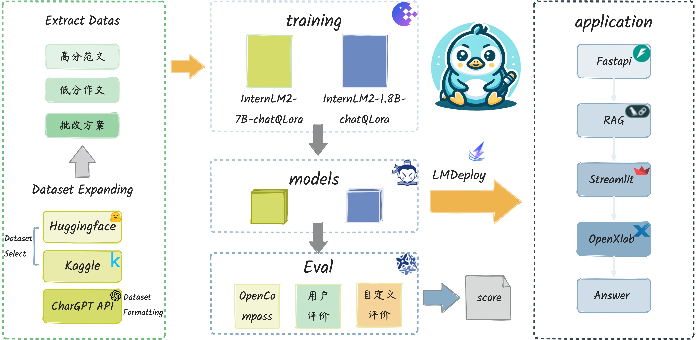

# 雅鸭IELTSDuck - IELTS作文小助手
<div align="center">


  <div align="center">
    <b><font size="5">雅鸭IELTSDuck - IELTS作文小助手</font></b>
  </div>


[![license][license-image]][license-url]
[![evaluation][evaluation-image]][evaluation-url]

[🤗HuggingFace]() | [![OpenXLab_Model][OpenXLab_Model-image]][OpenXLab_Model-url] | [ ModelScope][ModelScope-url]

[🆕Update News](#-news) | [🤔Reporting Issues][Issues-url] 丨 
 [简体中文](./README.md)

[license-image]: ./images/license.svg
[evaluation-image]: ./images/compass_support.svg
[OpenXLab_Model-image]: https://cdn-static.openxlab.org.cn/header/openxlab_models.svg
[OpenXLab_App-image]: https://cdn-static.openxlab.org.cn/app-center/openxlab_app.svg
[bilibili-image]: https://img.shields.io/badge/AMchat-bilibili-%23fb7299

[license-url]: ./LICENSE
[evaluation-url]: https://github.com/internLM/OpenCompass/
[OpenXLab_Model-url]: https://openxlab.org.cn/models/detail/milowang/IELTS_essay_eval_7b_v1
[OpenXLab_App-url]: https://openxlab.org.cn/apps/detail/Fayche/IELTSDuck
[ModelScope-url]: https://www.modelscope.cn/models/ModelE/IELTSDuck-Chat-7B/summary
[Issues-url]: https://github.com/neverbiasu/IELTSDuck/issues


</div>

## 📝目录

- [雅鸭IELTSDuck - IELTS作文小助手](#雅鸭ieltsduck---ielts作文小助手)
  - [📝目录](#目录)
  - [📖 项目概述](#-项目概述)
    - [😊 主要功能](#-主要功能)
    - [🛠️ 项目愿景](#️-项目愿景)
  - [🔗 模型及体验地址](#-模型及体验地址)
  - [🚀 News](#-news)
  - [🧾 数据集](#-数据集)
  - [💼 使用方法](#-使用方法)
    - [快速开始](#快速开始)
    - [重新训练](#重新训练)
      - [XTuner微调](#xtuner微调)
    - [部署](#部署)
      - [OpenXLab 部署 IELTDuck](#openxlab-部署-ieltduck)
      - [LmDeploy部署](#lmdeploy部署)
    - [测评与量化](#测评与量化)
      - [OpneCompass 评测](#opnecompass-评测)
      - [Lmdeploy\&opencompass 量化以及量化评测](#lmdeployopencompass-量化以及量化评测)
        - [`W4`量化评测](#w4量化评测)
        - [`KV Cache`量化评测](#kv-cache量化评测)
  - [⚠️ 注意](#️-注意)
  - [💕 致谢](#-致谢)


## 📖 项目概述

&emsp;&emsp;雅鸭IELTSDuck是一款基于[InternLM2](https://github.com/InternLM/InternLM.git)进行QLoRA微调,专为雅思考生（主要针对初级与中级水平学习者）开发的创新LLMs辅导工具，旨在通过综合提升学生的雅思写作能力。

> 雅思考试是为那些打算在以英语作为交流语言的国家和地区留学或就业的人们设置的英语言水平考试，从听、说、读、写四方面进行英语能力全面考核，能够立体综合地精准测评考生的英语语言运用能力。


&emsp;&emsp;雅鸭IELTSDuck整合了作文结构引导、语法检查与改进、内容与逻辑评估以及智能评分等多功能，致力于帮助学生提升雅思写作水平。

> 雅思考试评分标准包括：语言的流利度和连贯性，词汇变换，句式丰富性和语法准确性，发音。雅思考试考官按这四项评分标准分别评等级分，并且这四项是同等重要的。雅思成绩包括一个总分，及听力、阅读、写作和口语四个单项分，考生的考试成绩采用1-9分的评分制来测评，四个项目独立记分，总分即是四个部分所得分数经过平均后四舍五入的成绩。总分和四个单项分均允许半分。

### 😊 主要功能

- **固定模板输出模块：** 利用LLMs技术，提供针对雅思写作评分的专业、有逻辑、分点清晰的模板，帮助学生构建作文结构。
- **语法检查与改进模块：** 通过Langchain RAG技术和InternLM大型语言模型的整合，实时识别并纠正作文中的语法错误，并给出具体的修改建议。
- **内容与逻辑评估模块：** 对学生的作文进行全面分析，给出针对性的优化建议，确保作文内容、结构和逻辑满足雅思官方评分标准。
- **智能评分模块：** 通过微调InternLM，自动评估学生作文的综合质量，提供接近官方评分标准的分数，并给出改善作文的具体指导。

### 🛠️ 项目愿景

雅鸭IELTSDuck致力于帮助学生提升雅思写作成绩，同时通过系统化学习和练习，培养学生的逻辑思维和语言表达能力，助力学生在全球化语境中进行有效沟通。

雅鸭IELTSDuck全流程如图所示：

<p align="center">
    
</p>

## 🔗 模型及体验地址
***ModelScope 模型地址：***

**https://www.modelscope.cn/models/ModelE/IELTSDuck-Chat-7B/summary**

***OpenXLab 模型地址：***

**https://openxlab.org.cn/models/detail/milowang/IELTS_essay_eval_7b_v1**

***OpenXLab 应用***

**https://openxlab.org.cn/apps/detail/Fayche/IELTSDuck**

## 🚀 News


## 🧾 数据集

&emsp;&emsp;雅鸭IELTSDuck使用爬虫将网络上中雅思作文的数据提取出来，作为数据集使用。数据集采用雅思不同成绩的作文以及作文的批改建议，
<details>
<summary>数据集样例：</summary>

题目
```text

Interview form the basic selection criteria for most large companies. However, some people think that interview is not a reliable method of choosing whom to employ and there are better methods. To what extent to you agree or disagree?	
```
文章
```text
To agree or disagree with the statement that interviews are the basic filteration criteria is an important issue. Putting the discussion in a wider context, interviews has always been debatable. Even though some people think that there are better methods for employing a resource rather than interviews , I wholeheartedly believe that interview is a good method for recruiting candidates. First I will discuss some arguments supporting my ideas about this statement, after which some aspects against that will be presented.

On the one hand, many people agree with this statement for many noteworthy reasons. The most remarkable is that the recruiters can get an idea about the personalitty and skills of the potential employees .For instance,when the person is asked about any topic and he answers it in a concise and crisp manner,then the recruiter gets to know he is suitable for the job. Another key reason is that if a candidate is asked about case studies then the recruiters can judge the personality traits of that employee and also the ability to think outside the box.

On the other hand, other people disagree with this statement for many reasons. They believe that other modes of recruiting like written tests and group discussions will help understand the mindset in a better manner.Written tests help in evaluating the technical or theoretical knowlege of a person.

Group discussions help in getting a grasp of the conversational skills that he/she possesses.For example,in sales and marketing jobs conversational skills play a major role.

All in all, when all the specific reasons and relevant examples are considered and evaluated, I strongly agree with the idea supporting this statement because its benefits outweigh its drawbacks.
```
批改建议
```text
**Task Achievement (6.5)**
- The essay effectively addresses the task and presents a clear stance on the issue of whether interviews are a reliable method of employee selection.
- The ideas presented are relevant to the task and are supported with appropriate arguments and examples.
- The essay covers all aspects of the task, including the advantages and disadvantages of using interviews for hiring.

**Coherence and Cohesion (7.0)**
- The essay is well-organized and the transitions between sentences and paragraphs are smooth and logical.
- The use of connecting words and phrases helps maintain a clear progression of ideas.
- The essay follows a logical structure, with an introduction, body paragraphs that present opposing viewpoints, and a conclusion that summarizes the main points.

**Lexical Resource (6.0)**
- The essay uses a range of vocabulary, including some more complex and technical terms related to the topic of employee selection.
- There are some minor inaccuracies in vocabulary usage, such as the use of "personalitty" instead of "personality" and "crisp" instead of "clear."
- The vocabulary is generally appropriate for the given context.

**Grammatical Range and Accuracy (6.5)**
- The essay exhibits a variety of sentence structures, including complex and compound sentences.
- There are some grammatical errors, such as incorrect verb forms (e.g., "helps understand" instead of "helps one understand") and sentence construction (e.g., "For example,in sales and marketing jobs conversational skills play a major role.").
- The use of punctuation is generally correct, but there are some minor errors with commas.

**Overall Band Score: 6.5**
- The essay meets the requirements of the task and presents a clear and well-supported argument.
- The organization and structure of the essay are logical and coherent.
- The use of vocabulary is generally appropriate, but with some minor inaccuracies.
- There are some grammatical errors, but they do not significantly affect the overall quality of the essay.

**Feedback and Additional Comments:**

- **Strengths:** The essay effectively addresses the task, presents a clear stance, and provides relevant arguments and examples. The organization and structure of the essay are also strong.
- **Areas for improvement:** The essay could be improved by addressing the grammatical errors and inaccuracies in vocabulary usage. Additionally, the use of more complex sentence structures and a wider range of vocabulary would enhance the overall quality of the essay.	6.5
```
</details>

## 💼 使用方法
### 快速开始

<!-- ## 微调 -->

1. clone 本项目

```bash
git clone https://github.com/neverbiasu/IELTSDuck.git
cd IELTSDuck
```

2. 创建环境

```bash
# conda 创建虚拟环境（可选）
conda create -n ieltsduck python=3.8
conda activate ieltsduck
# 安装所需依赖
pip install -r requirements.txt
```

3. 下载模型

<details>
<summary> 从 ModelScope </summary>

参考 [模型的下载](https://www.modelscope.cn/docs/%E6%A8%A1%E5%9E%8B%E7%9A%84%E4%B8%8B%E8%BD%BD) 。

```bash
pip install modelscope
```

```python
from modelscope.hub.snapshot_download import snapshot_download
model_dir = snapshot_download('ModelE/IELTSDuck-Chat-7B', cache_dir='./')
```

</details>


<details>
<summary> 从 OpenXLab </summary>

参考 [下载模型](https://openxlab.org.cn/docs/models/%E4%B8%8B%E8%BD%BD%E6%A8%A1%E5%9E%8B.html) 。

```bash
pip install openxlab
```

```python
from openxlab.model import download
download(model_repo='milowang/IELTS_essay_eval_cn_7b_v1', 
        model_name='IELTSDuck', output='./')
```

</details>

4. 本地部署

```bash
python app.py
```
### 重新训练

>本模型使用使用 XTuner 训练， XTuner有各个模型的一键训练脚本，相对便捷。且对 InternLM2 的支持度最高。

#### XTuner微调

<details>
&emsp;&emsp;使用 XTuner 进行微调，具体脚本可参考[internlm2_chat_7b_qlora_ielts.py](./src/internlm2_chat_7b_qlora_ielts.py)，该脚本在`src`文件夹下。脚本内有较为详细的注释。

具体操作

要使用 XTuner 训练 `internlm2_chat_7b_qlora_ielts` 模型，请遵循以下步骤：

1. 激活 XTuner 环境：
```shell
conda activate xtuner0.1.17
```

2. 开始训练过程：
```shell
xtuner train internlm2_chat_7b_qlora_ielts.py --deepspeed deepspeed_zero2
```

要列出 `internlm2_7b` 模型的可用配置，请使用以下命令：
```shell
xtuner list-cfg -p internlm2_7b
```

要将训练好的模型从 `.pth` 格式转换为 Hugging Face 格式，请使用以下命令：
```shell
xtuner convert pth_to_hf internlm2_chat_7b_qlora_ielts.py work_dirs/internlm2_chat_7b_qlora_ielts/iter_52890.pth ./huggingface
```

要将转换后的模型与 `internlm2-chat-7b` 模型合并，请使用以下命令：
```shell
xtuner convert merge internlm2-chat-7b huggingface ielts_duck
```

最后，要与 `ielts_duck` 模型聊天，请使用以下命令：
```shell
xtuner chat ielts_duck --prompt-template internlm2_chat
```

请记得将占位符替换为适合您设置的适当路径和配置。

</details>

### 部署
<details>
  
#### OpenXLab 部署 IELTDuck

&emsp;&emsp;仅需要 Fork 本仓库，然后在 OpenXLab 上创建一个新的项目，将 Fork 的仓库与新建的项目关联，即可在 OpenXLab 上部署 IELTSDuck。

&emsp;&emsp;***OPenXLab IELTSDuck https://openxlab.org.cn/apps/detail/Fayche/IELTSDuck***


#### LmDeploy部署

- 首先安装LmDeploy

```shell
pip install -U lmdeploy
```

- 然后转换模型为`turbomind`格式

> --dst-path: 可以指定转换后的模型存储位置。

```shell
lmdeploy convert internlm2-chat-7b  要转化的模型地址 --dst-path 转换后的模型地址
```

- LmDeploy Chat 对话

```shell
lmdeploy chat turbomind 转换后的turbomind模型地址
```
### 测评与量化
#### OpneCompass 评测

- 安装 OpenCompass

```shell
git clone https://github.com/open-compass/opencompass
cd opencompass
pip install -e .
```

- 下载解压数据集

```shell
cp /share/temp/datasets/OpenCompassData-core-20231110.zip /root/opencompass/
unzip OpenCompassData-core-20231110.zip
```

- 评测启动！

```shell
python run.py \
    --datasets ceval_gen \
    --hf-path /root/model/huanhuan/kmno4zx/huanhuan-chat-internlm2 \
    --tokenizer-path /root/model/huanhuan/kmno4zx/huanhuan-chat-internlm2 \
    --tokenizer-kwargs padding_side='left' truncation='left'     trust_remote_code=True \
    --model-kwargs device_map='auto' trust_remote_code=True \
    --max-seq-len 2048 \
    --max-out-len 16 \
    --batch-size 2  \
    --num-gpus 1 \
    --debug
```

#### Lmdeploy&opencompass 量化以及量化评测  
##### `W4`量化评测  

- `W4`量化
```shell
lmdeploy lite auto_awq 要量化的模型地址 --work-dir 量化后的模型地址
```
- 转化为`TurbMind`
```shell
lmdeploy convert internlm2-chat-7b 量化后的模型地址  --model-format awq --group-size 128 --dst-path 转换后的模型地址
```
- 评测`config`编写  
```python
from mmengine.config import read_base
from opencompass.models.turbomind import TurboMindModel

with read_base():
 # choose a list of datasets   
 from .datasets.ceval.ceval_gen import ceval_datasets 
 # and output the results in a choosen format
#  from .summarizers.medium import summarizer

datasets = [*ceval_datasets]

internlm2_chat_7b = dict(
     type=TurboMindModel,
     abbr='internlm2-chat-7b-turbomind',
     path='转换后的模型地址',
     engine_config=dict(session_len=512,
         max_batch_size=2,
         rope_scaling_factor=1.0),
     gen_config=dict(top_k=1,
         top_p=0.8,
         temperature=1.0,
         max_new_tokens=100),
     max_out_len=100,
     max_seq_len=512,
     batch_size=2,
     concurrency=1,
     #  meta_template=internlm_meta_template,
     run_cfg=dict(num_gpus=1, num_procs=1),
)
models = [internlm2_chat_7b]

```
- 评测启动！
```shell
python run.py configs/eval_turbomind.py -w 指定结果保存路径
```
##### `KV Cache`量化评测 
- 转换为`TurbMind`
```shell
lmdeploy convert internlm2-chat-7b  模型路径 --dst-path 转换后模型路径
```
- 计算与获得量化参数
```shell
# 计算
lmdeploy lite calibrate 模型路径 --calib-dataset 'ptb' --calib-samples 128 --calib-seqlen 2048 --work-dir 参数保存路径
# 获取量化参数
lmdeploy lite kv_qparams 参数保存路径 转换后模型路径/triton_models/weights/ --num-tp 1
```
- 更改`quant_policy`改成`4`,更改上述`config`里面的路径
- 评测启动！
```shell
python run.py configs/eval_turbomind.py -w 结果保存路径
```
结果文件可在同目录文件[results](./results)中获取

</details>

## ⚠️ 注意

虽然雅鸭IELTSDuck致力于提升学生的雅思写作能力，但最终的学习成效还需依赖于个人的努力和实践。我们鼓励用户以积极主动的态度使用本系统，持续学习和练习。

## 💕 致谢

我们热烈欢迎并鼓励社区成员对雅鸭IELTSDuck项目做出贡献。如果您有兴趣帮助我们改进，请查看我们的[贡献指南](链接到贡献指南)。
